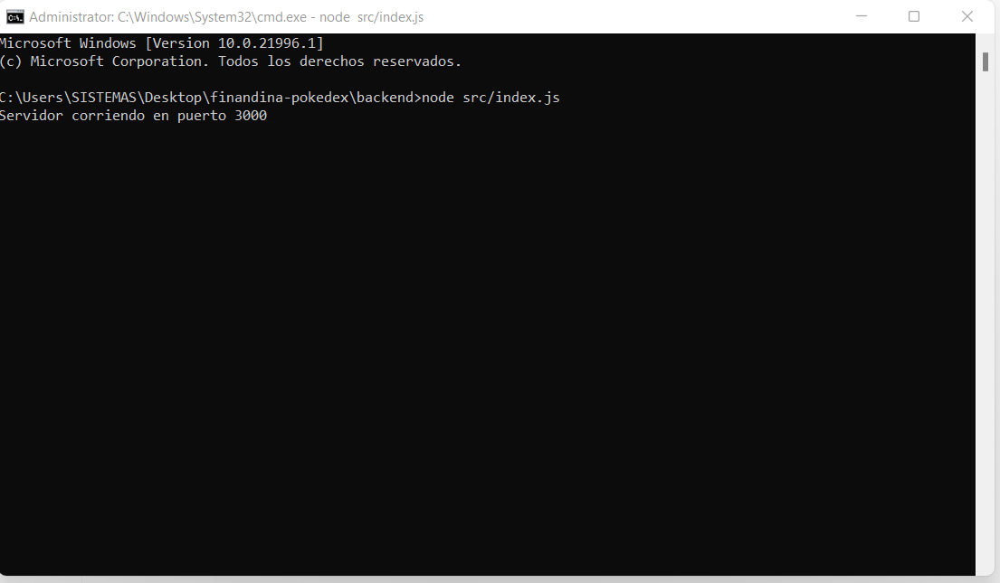
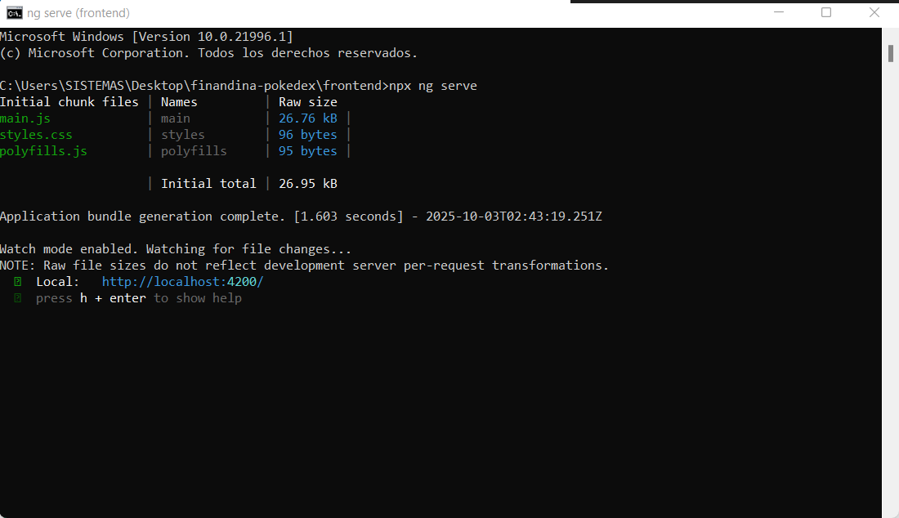
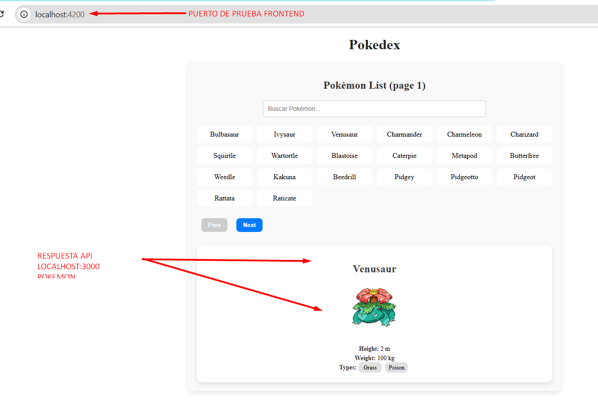
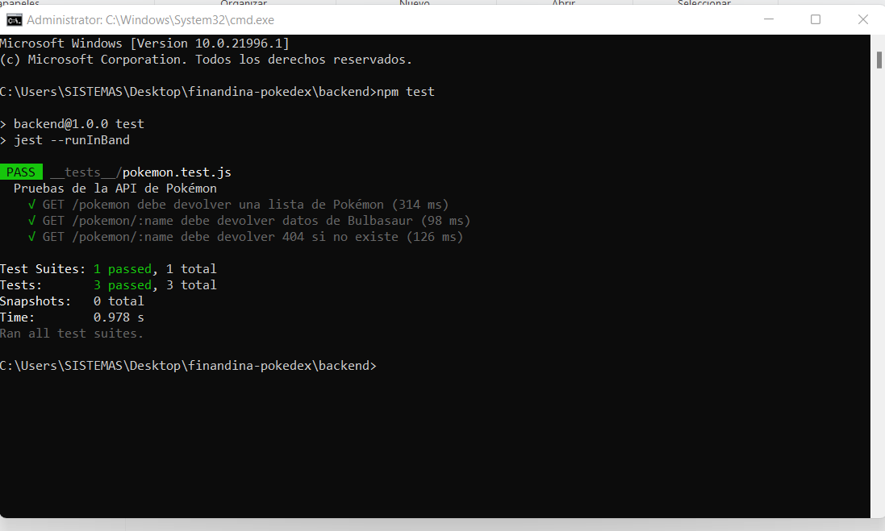
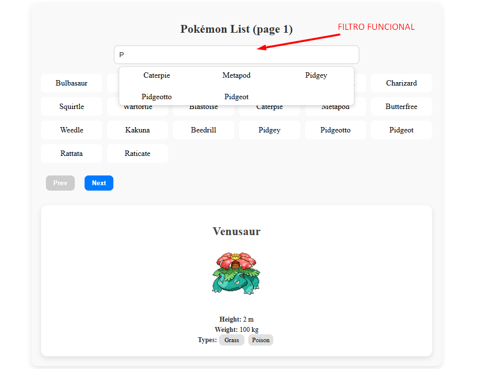

# Finandina Pokedex
Prueba técnica desarrollada en **Node.js (Express)** y **Angular**.  
La aplicación consume datos de [PokeAPI](https://pokeapi.co/) a través de un **backend propio** y los muestra en un **frontend en Angular** con buscador, lista paginada y detalle de cada Pokémon.

---

## Tecnologías utilizadas
- **Backend:** Node.js, Express, Axios, Jest, Supertest
- **Frontend:** Angular, TypeScript, SCSS
- **Otros:** Nodemon, Docker (opcional)

---

## Estructura del proyecto
finandina-pokedex/
│
├── backend/ # API REST en Express
│ ├── src/
│ │ ├── index.js
│ │ ├── routes/
│ │ └── controllers/
│ └── tests/pokemon.test.js
│
├── frontend/ # Aplicación Angular
│ └── src/app/
│ ├── services/
│ ├── components/
│ │ ├── pokemon-list/
│ │ └── pokemon-detail/

---

## Requisitos
- Node.js v18+
- Angular CLI (`npm install -g @angular/cli`)

---

## Instrucciones

### 1. Clonar repositorio
``bash
git clone https://github.com/tu-repo/finandina-pokedex.git
cd finandina-pokedex

---

### 2. Levantar el Backend
cd backend
npm install
npm run dev
La API corre en: http://localhost:3000

### 3. Levantar el Frontend
cd frontend
npm install
npx ng serve

El frontend corre en: http://localhost:4200
Endpoints disponibles (Backend)
GET /pokemon?page=1&limit=20 → Lista de Pokémon paginada.
GET /pokemon/:name → Detalle de un Pokémon.

---

# Capturas

### Corriendo backend

### Corriendo fronend

### Lista de Pokémon

### Corriendo TEST

### Corriendo FILTRO

---

# AWS

### URLs públicas

### Frontend (Angular en S3):

http://pokemon-frontend-cristian-finandina.s3-website.us-east-2.amazonaws.com

### Backend (Node/Express en Elastic Beanstalk):

http://pokemon-backend-env.eba-pgw9vanj.us-east-2.elasticbeanstalk.com